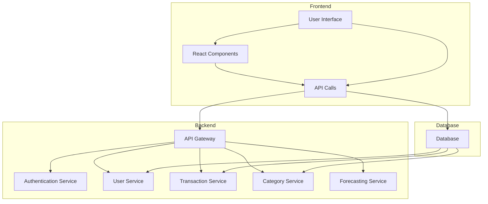
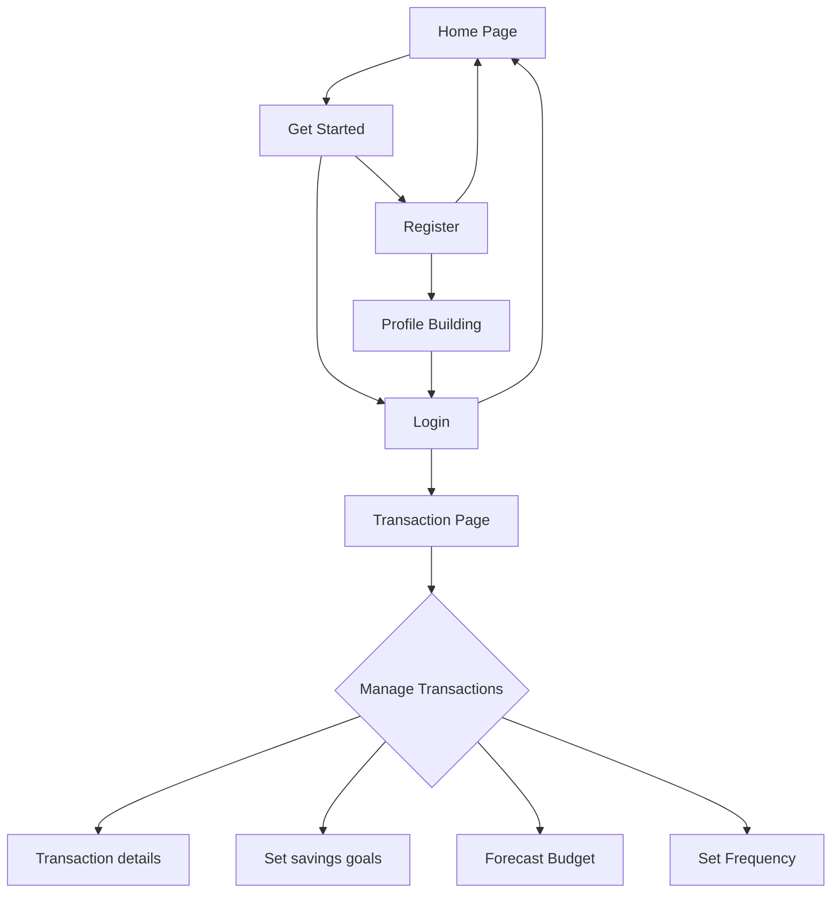
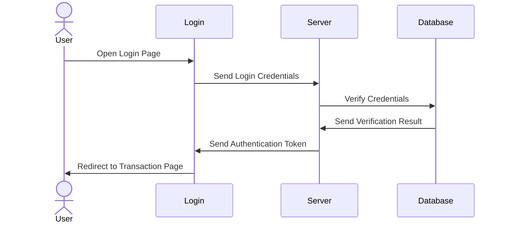
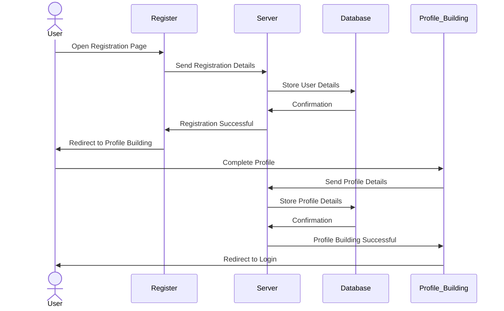
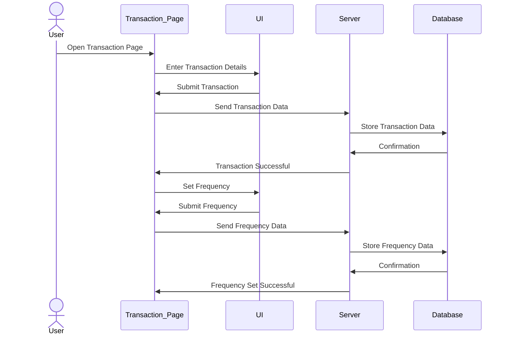
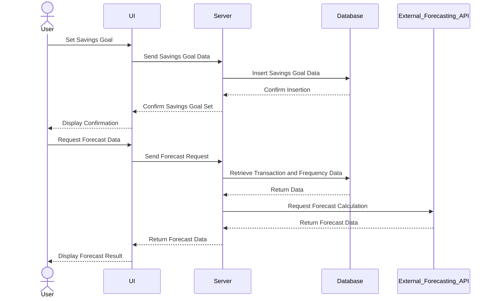
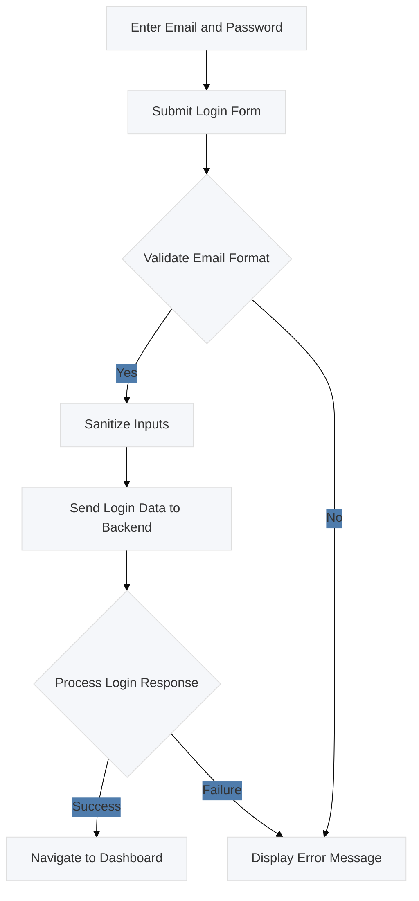
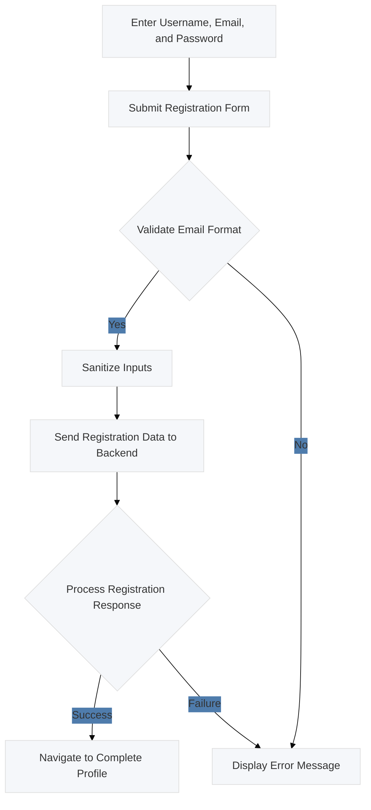
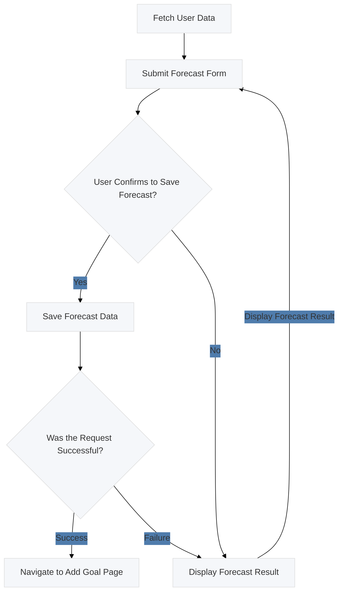
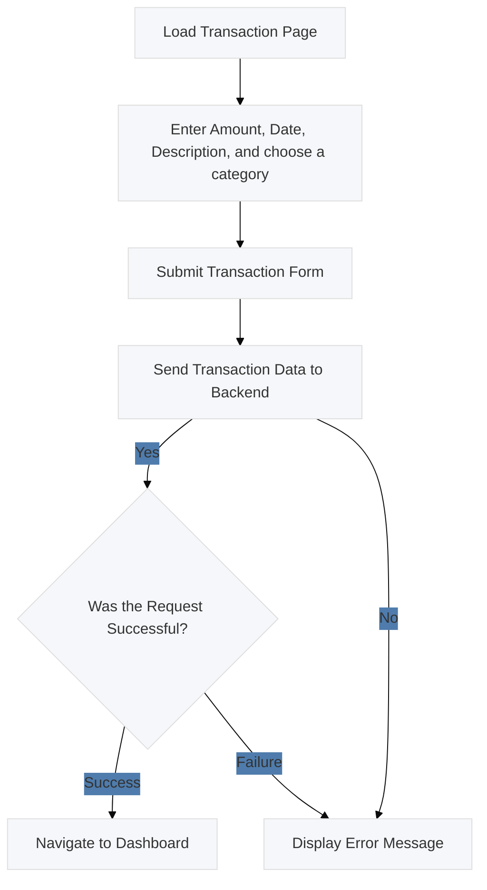

# High-Level Design Document

## Overview
Budget Minder is a web-based application designed to help users manage and forecast their monthly budgets. The application allows users to set savings goals, forecast the time required to achieve these goals, and ensures robust data security. The project consists of a React frontend and a Node.js/Express backend, with MongoDB for database management.

## Table of Contents
1. [Introduction](#introduction)
2. [System Requirements](#system-requirements)
3. [Architecture](#architecture)
4. [Components](#components)
5. [Detailed Component Descriptions](#detailed-component-descriptions)
6. [Architecture Diagram](#architecture-diagram)
7. [Activity Diagram](#activity-diagram)
8. [Sequence Diagram](#sequence-diagram)
9. [Usecase Diagram](#usecase-diagram)

## Introduction
Budget Minder is designed to provide users with tools to track their income, expenses, and savings goals. The system offers functionalities such as user registration, login, transaction management, and budget forecasting. The project leverages various open-source libraries and frameworks to deliver a seamless and secure user experience.

## System Requirements
- **Operating System**: Windows, macOS, Linux
- **Node.js**: >= 14.x
- **npm**: >= 6.x
- **Database**: MongoDB
- **Browser**: Latest versions of Chrome, Firefox, Safari, or Edge

## Architecture
The architecture of Budget Minder follows a typical Model-View-Controller (MVC) pattern:
- **Model**: Defines the data structure and database interaction.
- **View**: The user interface developed with React.
- **Controller**: Manages the application's logic and user input, developed with Express.

## Components
1. **Frontend (React)**:
   - User Interface for interacting with the application.
   - Components for registration, login, transaction management, and budget forecasting.
   
2. **Backend (Node.js/Express)**:
   - RESTful API to handle client requests.
   - Middleware for authentication and authorization.
   - Controllers for managing business logic.
   
3. **Database (MongoDB)**:
   - Stores user data, transactions, and categories.
   - Ensures data integrity and security.

## Detailed Component Descriptions

### Frontend (React)
- **Components**: 
  - **RegistrationForm**: Handles user registration.
  - **LoginForm**: Manages user login.
  - **Dashboard**: Displays user transactions and budget overview.
  - **TransactionList**: Shows a list of transactions.
  - **AddTransactionForm**: Form to add new transactions.
  - **GoalForm**: Allows users to set savings goals.
  - **ForecastForm**: Displays budget forecast based on user data.
  - **Chart**: Renders a line chart using Chart.js and react-chartjs-2.
  - **CompleteProfile**: Allows users to complete their profile by entering details.
  - **FeedbackForm**: Allows user to submit feedback.
  - **HomePage**: The main page for the Budget Minder application
  - **ParentComponent**: Sends the forecast data to the backend API and returns the response.
  - **ProfilePage**-: allows users to view and edit their profile information.
  - **TransactionForm**-:This component provides a form for adding or updating transactions.
- **State Management**: Uses React's Context API or Redux for managing global state.
- **Routing**: Utilizes React Router for navigation between different components.

### Backend (Node.js/Express)
- **Authentication Middleware**: Uses JWT for securing API endpoints.
- **Routes**:
  - **/api/register**: Endpoint for user registration.
  - **/api/login**: Endpoint for user login.
  - **/api/user**: Endpoint for fetching and updating user details.
  - **/api/transactions**: Endpoints for CRUD operations on transactions.
  - **/api/categories**: Endpoint for fetching transaction categories.
  - **/api/forecast**: Endpoint for saving, retrieving, and updating forecasts.
  - **api/feedback**: Endpoint for submitting and retrieving feedback.
  - **api/goal**: Endpoint for adding goals, forecasting goals, and retrieving goals.

- **Controllers**:
  - **authController**: Manages user authentication (registration, login).
  - **userController**: Handles user data operations (fetch, update profile).
  - **transactionController**: Manages transaction-related operations (add, edit, delete, fetch).
  - **categoryController**: Handles category data operations (fetch categories).
  - **feedbackController**: handling feedback submissions and retrieval.
  - **forecastController**: handling forecast operations.
  - **goalController**: handling goal operations

- **Models**:
  - **User**: Defines user data schema (username, email, password, etc.).
  - **Transaction**: Defines transaction data schema (userId, categoryId, amount, date, description).
  - **Category**: Defines category data schema (name, type).
  - **Goal**: Defines the schema and model for financial goals set by users.
  - **Forecast**: Defines the schema and model for forecasting financial goals.
  - **Feedback**: Defines the schema and model for feedback submitted by users.

### Database 
- **Schema Definitions**:
  - **User**: Stores user information and credentials.
  - **Transaction**: Records financial transactions.
  - **Category**: Defines income and expense categories.
  - **Goal**: stores financial goals set by users.
  - **Forecast**: stores forecasting financial goals.
  - **Feedback**: stores feedback submitted by users.
- **Relationships**:
  - **User has many Transactions**: Each user can have multiple transactions.
  - **Transaction belongs to User**: Each transaction is linked to a specific user.
  - **Category has many Transactions**: Each category can have multiple transactions.
  - **Transaction belongs to Category**: Each transaction is linked to a specific category.

## Architecture Diagram

## Activity Diagram

## Sequence Diagram
### Sequence Diagram for Login

### Sequence Diagram for Registration

### Sequence Diagram for Transaction Management

### Sequence Diagram for Forecasting Flow with Savings Goals 

### Usecase Diagram
## usecase diagram for Login

## usecase diagram for Registration

## usecase diagram for Budget Forecast

## usecase diagram for adding income and Expense

 
