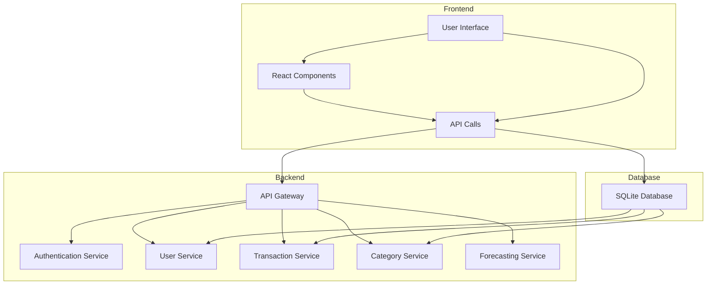
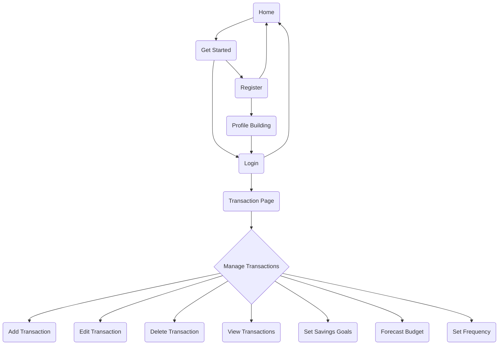

# High-Level Design Document

## Overview
Budget Minder is a web-based application designed to help users manage and forecast their monthly budgets. The application allows users to set savings goals, forecast the time required to achieve these goals, and ensures robust data security. The project consists of a React frontend and a Node.js/Express backend, with MYSQL and Sequelize for database management.

## Table of Contents
1. [Introduction](#introduction)
2. [System Requirements](#system-requirements)
3. [Architecture](#architecture)
4. [Components](#components)
5. [Detailed Component Descriptions](#detailed-component-descriptions)
6. [Architecture Diagram](#detailed-architecture-flow)
7. [Activity Diagram](#detailed-activity-diagram)
8. [Sequence Diagram](#detailed-sequence-flow)

## Introduction
Budget Minder is designed to provide users with tools to track their income, expenses, and savings goals. The system offers functionalities such as user registration, login, transaction management, and budget forecasting. The project leverages various open-source libraries and frameworks to deliver a seamless and secure user experience.

## System Requirements
- **Operating System**: Windows, macOS, Linux
- **Node.js**: >= 14.x
- **npm**: >= 6.x
- **Database**: MYSQL (using Sequelize ORM)
- **Browser**: Latest versions of Chrome, Firefox, Safari, or Edge

## Architecture
The architecture of Budget Minder follows a typical Model-View-Controller (MVC) pattern:
- **Model**: Defines the data structure and database interaction using Sequelize ORM.
- **View**: The user interface developed with React.
- **Controller**: Manages the application's logic and user input, developed with Express.

## Components
1. **Frontend (React)**:
   - User Interface for interacting with the application.
   - Components for registration, login, transaction management, and budget forecasting.
   
2. **Backend (Node.js/Express)**:
   - RESTful API to handle client requests.
   - Middleware for authentication and authorization.
   - Controllers for managing business logic.
   
3. **Database (MYSQL with Sequelize)**:
   - Stores user data, transactions, and categories.
   - Ensures data integrity and security.

## Detailed Component Descriptions

### Frontend (React)
- **Components**: 
  - **RegistrationForm**: Handles user registration.
  - **LoginForm**: Manages user login.
  - **Dashboard**: Displays user transactions and budget overview.
  - **TransactionList**: Shows a list of transactions.
  - **AddTransactionForm**: Form to add new transactions.
  - **EditTransactionForm**: Form to edit existing transactions.
  - **SavingsGoalForm**: Allows users to set savings goals.
  - **Forecast**: Displays budget forecast based on user data.

- **State Management**: Uses React's Context API or Redux for managing global state.
- **Routing**: Utilizes React Router for navigation between different components.

### Backend (Node.js/Express)
- **Authentication Middleware**: Uses JWT for securing API endpoints.
- **Routes**:
  - **/api/register**: Endpoint for user registration.
  - **/api/login**: Endpoint for user login.
  - **/api/user**: Endpoint for fetching and updating user details.
  - **/api/transactions**: Endpoints for CRUD operations on transactions.
  - **/api/categories**: Endpoint for fetching transaction categories.

- **Controllers**:
  - **authController**: Manages user authentication (registration, login).
  - **userController**: Handles user data operations (fetch, update profile).
  - **transactionController**: Manages transaction-related operations (add, edit, delete, fetch).
  - **categoryController**: Handles category data operations (fetch categories).

- **Models**:
  - **User**: Defines user data schema (username, email, password, etc.).
  - **Transaction**: Defines transaction data schema (userId, categoryId, amount, date, description).
  - **Category**: Defines category data schema (name, type).

### Database 
- **Schema Definitions**:
  - **User**: Stores user information and credentials.
  - **Transaction**: Records financial transactions.
  - **Category**: Defines income and expense categories.

- **Relationships**:
  - **User has many Transactions**: Each user can have multiple transactions.
  - **Transaction belongs to User**: Each transaction is linked to a specific user.
  - **Category has many Transactions**: Each category can have multiple transactions.
  - **Transaction belongs to Category**: Each transaction is linked to a specific category.

## Architecture Diagram

## Activity Diagram



## Sequence Diagram
```mermaid
sequenceDiagram
    actor User
    User ->> Home: Open Home Page
    Get_Started ->> Login: Login
    Home ->> Get_Started: Click Get Started
    Get_Started ->> Register:  Register
    Register ->> Profile_Building: Complete Registration and Profile Building
    Profile_Building ->> Login: Redirect to Login
    Register ->> Home: Going back to home page
    Login ->> Transaction_Page: Redirect to Transaction Page
    Login ->> Home: Going back to home page
    

    User ->> Transaction_Page: Open Transaction Page
    Transaction_Page ->> Add_Transaction: Add Transaction
    Transaction_Page ->> Edit_Transaction: Edit Transaction
    Transaction_Page ->> Delete_Transaction: Delete Transaction
    Transaction_Page ->> View_Transactions: View Transactions
    Transaction_Page ->> Set_Savings_Goals: Set Savings Goals
    Transaction_Page ->> Forecast_Budget: Forecast Budget
    Transaction_Page ->> Set_Frequency: Set Frequency
    


 
