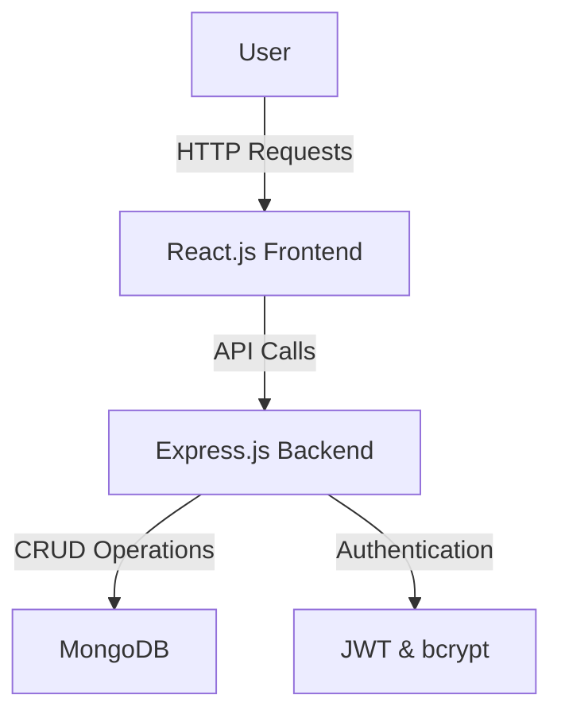

# Budget Minder

Budget Minder is a web-based application designed to help users manage and forecast their monthly budgets. Users can input their income and expenses, set savings goals, and track their progress. The application provides robust data security and user-friendly interfaces for a seamless budgeting experience.

## Table of Contents

- [Features](#features)
- [Tech Stack](#tech-stack)
- [Installation](#installation)
- [Usage](#usage)
- [API Endpoints](#api-endpoints)
- [Team](#team)
- [Architecture Diagram](#architecture-diagram)
- [Design Document](#design-document)

## Features

- User authentication (registration and login)
- Secure password storage using bcrypt
- JWT-based authentication
- CRUD operations for transactions (income and expenses)
- Categories for income and expenses
- User profile management
- Real-time budget tracking and forecasting

## Tech Stack

- **Frontend**: React
- **Backend**: Node.js, Express.js
- **Database**: MongoDB 
- **Authentication**: JWT (JSON Web Tokens)
- **Others**: bcrypt for password hashing, cors for Cross-Origin Resource Sharing, body-parser for parsing incoming request bodies

## Installation

### Prerequisites

- Node.js (v14.x or higher)
- npm (v6.x or higher)

### Backend Setup

1. Clone the repository:

    ```bash
    git clone https://github.com/mrpateljeet/Group_3_Engineers.git
    cd budget-minder
    ```

2. Install backend dependencies:

    ```bash
    cd backend
    npm install
    ```

3. Start the backend server:

    ```bash
    npm run dev
    ```

### Frontend Setup

1. Navigate to the `frontend` directory:

    ```bash
    cd ../frontend
    ```

2. Install frontend dependencies:

    ```bash
    npm install
    ```

3. Start the frontend development server:

    ```bash
    npm start
    ```

## Usage

1. Open your browser and navigate to `http://localhost:3000` to access the application.
2. Register a new user account.
3. Log in with your credentials.
4. The application allows users to add, edit, delete, and view transactions.
5. Manage categories and track your budget.

## API Endpoints

### Authentication

- **POST /api/register**: Register a new user.
- **POST /api/login**: Log in an existing user.
- **GET /api/user**: Fetch user profile.
- **PUT /api/user**: Update user profile.

### Transactions

- **POST /api/transactions**: Add a new transaction.
- **PUT /api/transactions/:id**: Edit a transaction.
- **DELETE /api/transactions/:id**: Delete a transaction.
- **GET /api/transactions**: Get all transactions for a user.

### Categories

- **GET /api/categories**: Get all categories.

### Forecasts

- **GET /api/forecast** : Endpoint for retrieving forecasts.
- **PUT /api/forecast** : Endpoint for saving forecasts.

### Feedback

- **GET api/feedback** : Endpoint for retrieving feedback.
- **PUT api/feedback** : Endpoint for submitting feedback.

### Goal
- **GET api/feedback**: Endpoint for retrieving feedback.
- **PUT api/feedback**: Endpoint for submitting feedback.
  
## System Requirements

- **Node.js**: v14.x or higher
- **npm**: v6.x or higher
- **MySQL**: Ensure MySQL server is installed and running
- **Operating System**: Compatible with Windows, macOS, and Linux

## Compatible OSes

- Windows 10 or higher
- macOS 10.15 Catalina or higher
- Ubuntu 18.04 or higher

## Library Requirements

- **Backend**:
  - `express`
  - `bcrypt`
  - `jsonwebtoken`
  - `cors`
  - `body-parser`
  
- **Frontend**:
  - `react`
  - `axios`


- ## Team

- **Jeet R Patel** (Scrum Master)
- **Pranitha Bollepalli**
- **Nikhith Beta**
- **Chanakya Dandamudi**
- **Vineeth Ketham**


##  Architecture Diagram


## Design Document
https://github.com/mrpateljeet/Group_3_Engineers/blob/main/HighLevelDesign.md
